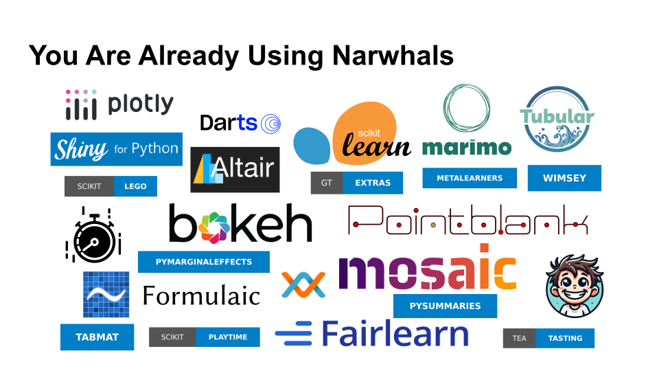

# Friendly Narwhals & DataFrames

All of the examples are self-contained. Meaning you can copy/paste them into
an editor and run them. To reproduce the packages I used today, they are all specified via `pixi`
in the `pixi.toml` and `pixi.lock` files.

To run any example:

**First Time Set up Steps**
- Clone this repo: `git clone https://github.com/camriddell/posit-dslab-narwhals-2026-06-30`
- Change into this directory: `cd posit-dslab-narwhals-2026-06-30`
- Install pixi: https://pixi.prefix.dev/latest/installation/

**Workflow Steps**
- Copy the relevant code example into a Python file (e.g. `example.py`)
- `pixi run python example.py`

```python
print("Let's talk Narwhals & DataFrames!")
```

## What is Narwhals

Narwhals is a lightweight (read as: dependency-free) Data/LazyFrame interface.

There is a good chance that **you’re already using Narwhals** without even knowing it!

Narwhals is used by

- Libraries whose audience bring their own DataFrames
    - e.g. py-shiny, gt-extras, plotly, altair, bokeh, sklearn, pandera
- Some subset of people who don’t like writing SQL


The image is missing a couple of packages that have been added since May 2026

```sh
eog -f images/narwhals-downstream.svg 2&>1 /dev/null
```

### DataFrame Agnostic Expressions

Columnar sum across different dataframes

```python
import pandas as pd
import polars as pl
import duckdb
from utils import printh

pd_df = pd.DataFrame({'value': [1,2,3,4,5]})
pl_df = pl.from_pandas(pd_df)
duck_df = duckdb.sql("select * from pl_df")


# printh(
#     pd_df[['value']].sum(),
#     pl_df.select(pl.col('value').sum()),
#     duckdb.sql("select sum(value) from duck_df"),
# )

import narwhals as nw

def agnostic_sum(df, column):
    return (
        nw.from_native(df)
        .select(nw.col('value').sum())
        .to_native()
    )

printh(
    agnostic_sum(pd_df, 'value'),
    agnostic_sum(pl_df, 'value'),
    agnostic_sum(duck_df, 'value'),
)
```

### Avoiding SQL

```python

...
```

## Why are DataFrames Challenging in Python?

- DataFrames have been around for 15 years in Python
- For ~10 of those years, `pandas` was the only choice
∴  many packages were designed to cater specifically to pandas

But looking at the DataFrame horizon today...


```sh
eog -f images/narwhals-dataframes.svg
```

And along the way, they all made different decisions, not just in API
design but also in both the storage and treament of underlying values.

### Index Alignment (pandas only)

Can you guess the output of each of these pandas operations?
pandas aligns the row and column indices (think rownames and colnames) before
performing actions that span multiple DataFrames.

This behavior extends to the `pandas.Series` as well

```python
from pandas import DataFrame

df_a = DataFrame({'a': [1,2,3]})
df_b = DataFrame({'b': [1,2,3]})

print(df_a + df_b)
#     a   b
# 0 NaN NaN
# 1 NaN NaN
# 2 NaN NaN
```

```python
from pandas import DataFrame

df_a = DataFrame({'a': [1,2,3]}, index=[0, 1, 2   ])
df_b = DataFrame({'a': [1,2,3]}, index=[   1, 2, 3])

print(df_a + df_b)
#      a
# 0  NaN
# 1  3.0
# 2  5.0
# 3  NaN
```

## Null vs NaN Distinctions

pandas doesn’t really distinguish Null values from NaN values.
Every other tool does.

```python
import pandas as pd
import polars as pl
import duckdb

from utils import printh

pd_df = pd.DataFrame({'a': [1.0, float('nan'), None]})
pl_df = pl.DataFrame({'a': [1.0, float('nan'), None]})
duck_df = duckdb.sql('''select * from pl_df''')

printh(pd_df, pl_df, duck_df) # Note that pandas does not have "Null" value
#     a        shape: (3, 1)        ┌────────┐
#0  1.0        ┌──────┐             │   a    │
#1  NaN        │ a    │             │ double │
#2  NaN        │ ---  │             ├────────┤
#              │ f64  │             │    1.0 │
#              ╞══════╡             │    nan │
#              │ 1.0  │             │   NULL │
#              │ NaN  │             └────────┘
#              │ null │
#              └──────┘

# pandas does have `pd.NA`, but this doesn’t play nicely with NaN values
#   Nullable types are supported via "capital" letter datatypes, or by wrapping Arrow arrays instead of numpy
#   But notice that the previous NaN value is now Null!
print(pd_df['a'].astype('Float64'))
# 0     1.0
# 1    <NA>
# 2    <NA>
# Name: a, dtype: Float64

# Polars - Validity Buffers; Null values are kept "out of band"
buffers = pl_df['a']._get_buffers()
print(buffers['validity'], buffers['values'], sep='\n\n')
# shape: (3,) # whereever this buffer is "false", the resultant Series has a Null value
# Series: 'a' [bool]
# [
#         true
#         true
#         false
# ]
# 
# shape: (3,)
# Series: 'a' [f64]
# [
#         1.0
#         NaN
#         0.0
# ]
```

## Narwhals is More Than a Syntax

**Grouped Sums**

Some of these tools don’t agree on the results of some basic computations

```python
import narwhals as nw
import pandas as pd
import polars as pl
import numpy as np
import duckdb

from utils import printh

rng = np.random.default_rng(0)

data = {
    "group": rng.choice(["A", "B", "C"], size=20),
    "value": rng.normal(loc=100, scale=15, size=20),
}

pd_df = pd.DataFrame(data).assign(value=lambda d: d['value'].mask(d['group'] == 'C'))
pl_df = pl.from_pandas(pd_df)
duck_df = duckdb.sql('select * from pl_df')

# 1. single dispatch/match case
def grouped_aggregation(df, grouping: str="group", value: str="value"):
    match df:
        case pd.DataFrame():
            return df.groupby(grouping).agg({value: "sum"})
        case pl.DataFrame():
            return df.group_by(grouping).agg(pl.col(value).sum())
        case duckdb.DuckDBPyRelation():
            return duckdb.sql(f'select "{grouping}", sum({value}) from df group by "{grouping}"')
    raise TypeError(f"Did not understand {type(df)}")

printh(
	grouped_aggregation(pd_df),
	grouped_aggregation(pl_df),
	grouped_aggregation(duck_df),
)
#             value        shape: (3, 2)                 ┌─────────┬───────────────────┐
# group                    ┌───────┬────────────┐        │  group  │   sum("value")    │
# A      560.311521        │ group ┆ value      │        │ varchar │      double       │
# B      727.266882        │ ---   ┆ ---        │        ├─────────┼───────────────────┤
# C        0.000000        │ str   ┆ f64        │        │ B       │ 727.2668823063682 │
#                          ╞═══════╪════════════╡        │ A       │ 560.3115214688792 │
#                          │ C     ┆ 0.0        │        │ C       │              NULL │
#                          │ A     ┆ 560.311521 │        └─────────┴───────────────────┘
#                          │ B     ┆ 727.266882 │                                       
#                          └───────┴────────────┘                                       

# 2. narwhals solution
def grouped_aggregation(df, grouping: str="group", value: str="value"):
	return (
		nw.from_native(df)
		.group_by(grouping)
		.agg(nw.col(value).sum())
		.to_native()
	)
printh(
	grouped_aggregation(pd_df),
	grouped_aggregation(pl_df),
	grouped_aggregation(duck_df),
)
#   group       value        shape: (3, 2)                 ┌─────────┬───────────────────┐
# 0     C    0.000000        ┌───────┬────────────┐        │  group  │       value       │
# 1     B  727.266882        │ group ┆ value      │        │ varchar │      double       │
# 2     A  560.311521        │ ---   ┆ ---        │        ├─────────┼───────────────────┤
#                            │ str   ┆ f64        │        │ C       │               0.0 │
#                            ╞═══════╪════════════╡        │ B       │ 727.2668823063682 │
#                            │ B     ┆ 727.266882 │        │ A       │ 560.3115214688792 │
#                            │ C     ┆ 0.0        │        └─────────┴───────────────────┘
#                            │ A     ┆ 560.311521 │                                       
#                            └───────┴────────────┘        
```

## When do we use Narwhals?

When you want to write analytical code that makes use of DataFrames,
but do not have control over the DataFrames that you are being handed.

Some minor nuance
- You enjoy writing expressions, rather than a bespoke DataFrame API
- You don’t like writing SQL and are using DuckDB

## When do we NOT use Narwhals?

When you are writing your own analytical pipeline.
If you are the one reading, analyzing, and manipulating the data
you’re likely better off to use one of the "native" DataFrame tools (pandas, Polars, etc.)

```python
import pandas as pd
import polars as pl
import narwhals as nw

df = pd.DataFrame({'a': [None,5,7,10], 'b':[ 1, 3, 4, 2], 'c': [5, 4, 3, 2]})
print(df.corr(method='pearson'))
```

## Minimal Overhead

```python
import pandas as pd
import polars as pl
import numpy as np
from string import ascii_lowercase
from time import perf_counter
from contextlib import contextmanager
import narwhals as nw

@contextmanager
def timed(msg):
    start = perf_counter()
    try:
        yield
    finally:
        stop = perf_counter()
        print(f'{msg:<30}{stop - start:.6f}')

rng = np.random.default_rng(0)

unique_groups = np.unique(rng.choice([*ascii_lowercase], size=(10_000, 4)).view('<U4'))

df = (
    pd.DataFrame({
        'groups': unique_groups.repeat(200),
    }).assign(values=lambda d: rng.uniform(0, 100, size=len(d)))
    .sample(frac=1)
)

with timed('pandas fast path'): # 0.07s
    df.groupby('groups')['values'].std()

with timed('pandas slow path'): # 0.63s
    df.groupby('groups')['values'].apply(lambda s: s.std())

with timed('narwhals only path'): # 0.09s
    nw.from_native(df).group_by('groups').agg(nw.col('values').std())

```

## How does Narwhals Even Work?

Many Layers of _Composition_

```python
import pandas as pd
from dataclasses import dataclass
from itertools import chain
from typing import Any
from utils import printh

@dataclass
class PandasExpr:
	func: Callable[[pd.DataFrame], list[pd.Series]]
	args: tuple[Any] = tuple()

	def __call__(self, df):
		return self.func(df)

	def mean(self):
		return type(self)(lambda df: [pd.Series(s.mean(), name=s.name) for s in self(df)])

	def __add__(self, other: 'PandasExpr' | int):
		if isinstance(other, type(self)):
		    other = other(df)[0]
		return type(self)(lambda df: [s + other for s in self(df)])

@dataclass
class PandasDataFrame:
	native: pd.DataFrame

	def select(self, *funcs: Callable[[pd.DataFrame], list[pd.Series]]):
		parts = chain.from_iterable(f(self.native) for f in funcs)
		return pd.concat([*parts], axis=1)

def col(name: str):
	def pandas_column(df: pd.DataFrame):
		return [df.loc[:, name]]
	return PandasExpr(pandas_column, args=(name,))

# script.py
# goal: df.select(col('a').mean())
import pandas as pd

df = pd.DataFrame({'a': [1,2,3], 'b': [4,5,6]})

printh(
	PandasDataFrame(df).select(col('a')),
	PandasDataFrame(df).select(col('a').mean()),
	PandasDataFrame(df).select(col('a') + col('b')),
)
#    a             a           0
# 0  1        0  2.0        0  5
# 1  2                      1  7
# 2  3                      2  9
```

